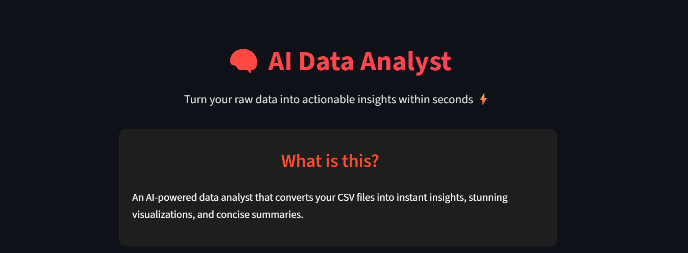
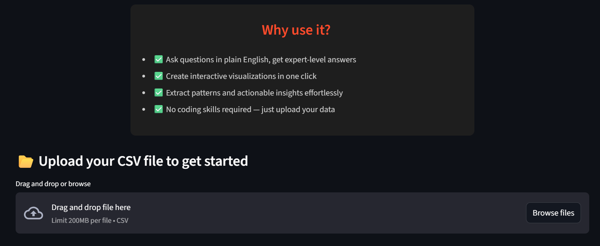
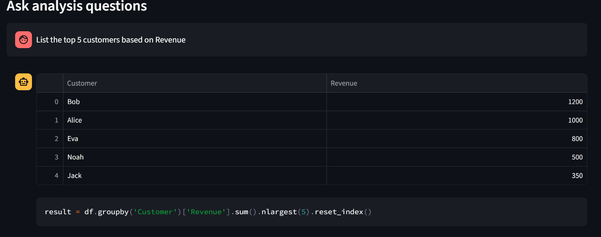
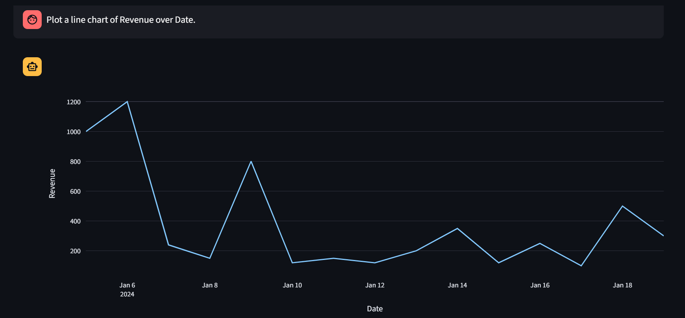
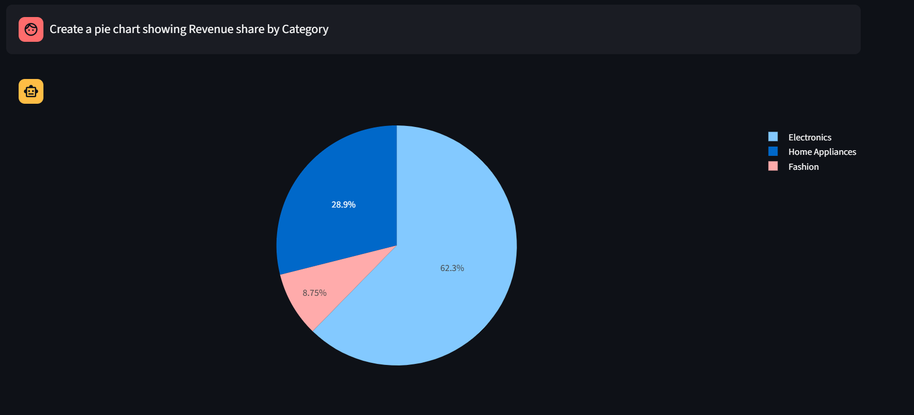
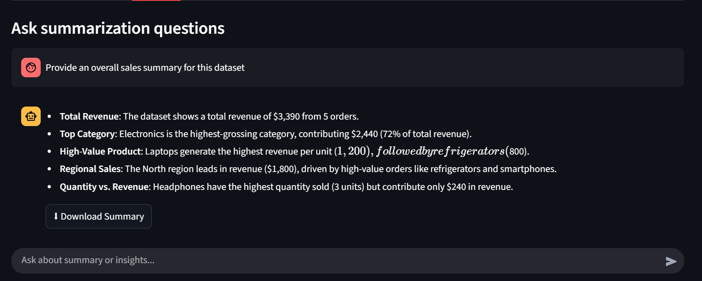
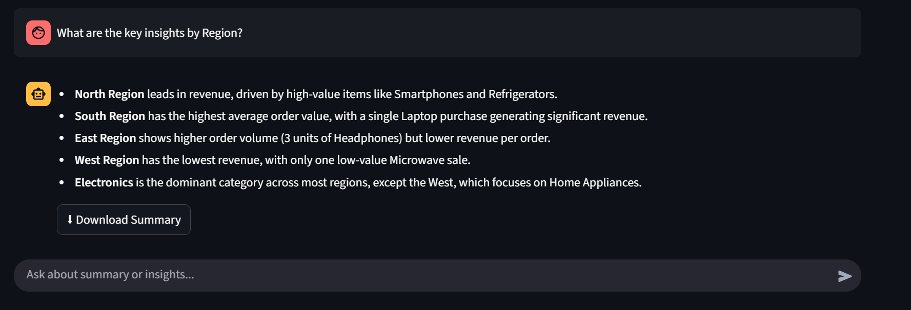

# 🧠 AI Data Analyst Agent (Streamlit + LangGraph)

## 🚀 Overview
**AI Data Analyst Agent** is an intelligent web app that transforms your CSV data into actionable insights using **Streamlit**, **LangGraph**, and **LLMs**.  
It can:
- Validate and clean datasets automatically.
- Answer natural language queries for analysis.
- Create interactive visualizations.
- Generate summaries and insights.

Unlike static dashboards, this is a **real AI Agent** powered by **hybrid LLM models** for reasoning and visualization.

---

## ✨ Features
✅ **Upload & Auto-Validate Data**
- Detects missing values, outliers, and mixed data types.
- Option to auto-correct data for accuracy.

✅ **Analysis Tab**
- Ask plain English queries like:  
  *"Find the top 5 customers by Revenue"*
- Returns:
  - ✅ Accurate table results.
  - ✅ Python code used for the calculation (transparency).

✅ **Visualization Tab**
- Generate **interactive charts** (bar, pie, line) from natural queries.

✅ **Summary Tab**
- Summarize trends and generate key insights.
- Download summaries as `.txt`.

✅ **Session History**
- Keeps previous questions and answers in all tabs.

✅ **Modern UI**
- Clean, responsive layout with custom CSS.

---

## 🧠 Agent Architecture

### **Hybrid Model Strategy**
- **Mistral** → For Analysis & Summarization (reasoning-focused).
- **LLaMA 3** → For Visualization (creative and structured output).

The agent dynamically:
- Interprets queries.
- Generates Python code.
- Executes code on the dataset.
- Returns **results + the code snippet** for transparency.

---

## 🖼 Screenshots

### Home

### Data Upload & Auto-Correction

### Analysis

### Visualization

### Summary

---

## 🛠 Tech Stack
- **Frontend:** Streamlit
- **Agent Framework:** LangGraph
- **Models:**  
  - Mistral → Analysis & Summary  
  - LLaMA 3 → Visualization  
- **Data Handling:** Pandas
- **Visualization:** Plotly
- **Language:** Python

---

## ⚠ Disclaimer
This public repository contains the **Streamlit app (`main.py`)** and assets for demo purposes.  
The **full working LangGraph agent code** (including nodes, execution logic, etc.) will be provided **on request** for educational or professional use.

📩 Contact: **syedsaadi427@gmail.com**

---

